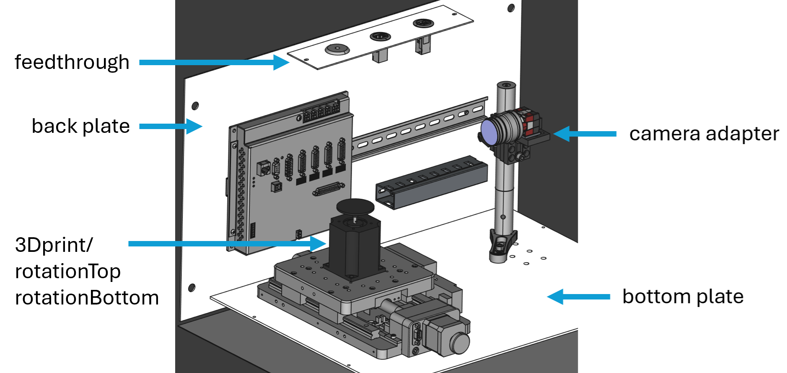

# BOLT: Beamline Operations and Learning Testbed

BOLT is described in detail here: https://indico.jacow.org/event/86/contributions/10430/ (currently links to abstract, will be updated to paper once published)

## Hardware

All information to replicate the setup is in this folder (`BOLT/hardware`). Overview:

<br>
- `CAD drawings` contains step files of all custom(ized) items (shown in the image above, step files created using https://www.freecad.org/, 3D print files created using  https://github.com/prusa3d/PrusaSlicer)
- `bill of materials` contains all commercially available prodcuts (with links)<br>
- `electrial wiring` describes how the motors are connected to the motor controller (created using https://www.kicad.org/)<br>

## Frontend/ Website

This repository currently provides only the frontend page for BOLT. Additional backend servers are required for the full functionality, which are not described here.
<br>More information on the frontend user interface can be found here https://epics.anl.gov/icalepcs-2025/pdf/THPD088.pdf

### Start Frontend Website
```
#.../BOLT/frontend
npm run dev
```

Navigate to [localhost:5173](localhost:5173)

### Installation Instructions
```
git clone https://github.com/als-computing/BOLT.git
cd BOLT
npm install
npm run dev
```

## Photogrammtry

An example implementation of a photogrammety reconstruction pipeline based on COLMAP (https://colmap.github.io/) and OpenMVS (https://github.com/cdcseacave/openMVS) is located in `BOLT/photogrammetry`.